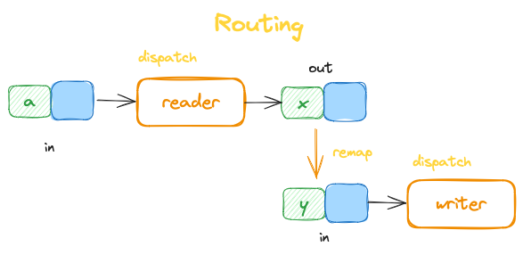

# goal
show how to manually build 0D in some existing language
# usage
$ python3 main.py
# rough sketches
## Main

## Container

## Routing
Ports "a", "x", "y" are fictitious, but, meant to show mapping of output port name to input port name during message routing.

# method
- for this exemplar, I use Python
- I build a simple file reader which consists of 3 components
  1. reader: read a char on request
  2. writer: request a char, read it and print it, repeat until EOF
  3.  top: (Container, router) connect 1 -> 2, and 2 -> 1, using 1-way connections only (bi-directional connections require extra software)
- hard-code children into Container (not necessary, done for sake of clarity)
- omit "direction" in Connection (needed to support recursive containers, omitted for sake of clarity)
# points of interest
1. connections are owned by a Container, not by the components themselves
   - components react to a single message at a time and produce outputs (plural) to an output queue, parent Container routes the messages
2. message routing requires mapping sender's output port to receiver's input port
3. message routing allows fan-out, hence, in general (before optimization) messages must be copied
   - fan-out is vital to abstraction which is used to simplify DX by enabling layering

# miscellaneous
- use draw.io (https://app.diagrams.net) to edit and read `zd.drawio`
- in this example, I manually wrote the code, but, elsewhere I show how to compile `.drawio` files into running Python (wip: https://github.com/guitarvydas/0D)